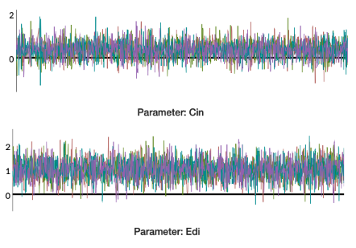

```{r setup, include=FALSE}
knitr::opts_chunk$set(echo = FALSE)
```

```{r, message = FALSE, warning = FALSE, echo = FALSE}
library(tidyverse)
library(broom)
require(rstanarm)
require(magrittr)
library(ggplot2)
require(loo)
require(bayesplot)
require(caret)
library(rstan)
require(HSAUR3)
library(patchwork)
```

```{r, message = FALSE, warning = FALSE, echo = FALSE}
oscars <- read_csv("data/oscars.csv")
director_noms <- oscars %>%
  filter(DD == 1, Year != 2006) %>%
  rename(win = Ch) %>%
  mutate(win = ifelse(win==1, 1, 0))
# win is 1 if a win, 0 if loss
```

# Introduction

  Every year, billions of people around the globe watch movies, and many tune in to watch the Academy Awards. This awards show is heavily publicized, promoted, and talked about every year, where millions of fans watch the ceremony and tens of millions read about it later. Receiving an Oscar is the highest honor that one can procure in the business of movie-making, and since movies are such a large industry and many of our country's most influential celebrities are movie stars, the Oscars is one of the biggest events there is each year in the United States. All this attention inevitably leads to general curiosity and predictions about who will take home the most prized awards in all of filmmaking, which is where the reason for this project arises.
  
  The goal of this project is to develop a model which will predict with as much accuracy as possible the winner of the "Best Director" category at the Oscars. Being able to predict Oscar winners is an analysis which many across the globe will have an interest in, whether they be data-lovers, typical cinephiles, or even gamblers who feel that they need an edge. 
  
  To achieve our goal, we will take several steps. First, we will perform exploratory data analysis on the data set we have in order to discover which variables have the potential to be explanatory variables for the model. Second, we will establish a clear prior for the model. Third, we will determine which explanatory variables should be used for the model by combining them with the prior to form a posterior, by creating several Bayesian logistical regression models and testing until we reach a model with optimal fit. Lastly, we will interpret the model coefficients and discuss its applications.

# Data

  The data set that we are using for this analysis is one that contains information about all Oscar nominations from 1928-2006. The data has been taken from the personal website of Iain Pardoe, an online educator in mathematics and statistics, in the form of a csv, which we read into R and made into a data frame. 
  
  In our model, we will attempt to use all relevant variables that may be significant predictors of whether a director wins best director or not. The data set given has 62 variables, of which one is an indicator variable specifying if the nominee is up for Best Director, and one of which is an indicator variable specifying if the nominee won their award or not. We will create our data set using only the instances where DD is equal to 1, as we are only focusing on predicting winners among nominated directors.
  
  To decide which variables to use, we performed EDA on many variables, but since we have limited space, we are only discussing the variables which might be relevant to our model. In other words, we will not display EDA on variables like AD (Whether the Assistant Director was nominated) because it simply did not have any relevance or correlation with the director winning Best Director.

  The variables that we performed EDA on are described below:
    
Nom: The total number of Oscar nominations that the director's movie received.
Pic: Director's movie was also nominated for best picture (indicator).
Scr: Director's movie was also nominated for best screenplay. We are unsure why there would be any reason why Scr is equal to 2, as the same movie cannot be nominated twice for best screenplay. We believe that is an issue in the data, though miniscule.
Cin: Director's movie was also nominated for best cinematography (indicator).
Edi: Director's movie was also nominated for best editing (indicator).
Eff: A variable that specifies if the director's movie was nominated for sound editing, visual effects, or both. For both, Eff = 2, for one and not the other, Eff = 1, and for neither, Eff = 0. 
Gd: Director's movie won a Golden Globe for Directing in the same award season(indicator).
DGA: Director's Guild of America win (indicator).
Year: The Year that the movie was nominated for an Oscar.
    

## Exploratory Data Analysis

```{r, echo = FALSE}
ggplot(data = director_noms, aes(x = Nom, fill = as.character(win))) + geom_histogram(binwidth = 1) + 
  labs(title = "Total Oscar Nominations", x = "Total Nominations")  + 
  scale_fill_manual(name = "Won", values = c("blue", "red"))
```
The above analysis makes it appear that the more nominations a movie has, the more likely the director is to win an Oscar. This is enough correlation to warrant adding it to our initial model. 

```{r}
e <- ggplot(director_noms, aes(fill = as.character(win), x = Pic)) +
  geom_histogram(binwidth = 1) + 
  labs(x = "Best Picture Nomination", y = "count") + 
  scale_fill_manual(name = "Won", values = c("blue", "red"))

# not indicator
f <-  ggplot(director_noms, aes(fill = as.character(win), x = Scr)) +
  geom_histogram(binwidth = 1) +
  labs(x = "Best Screenplay Nomination", y = "count") + 
  scale_fill_manual(name = "Won", values = c("blue", "red"))

g <- ggplot(director_noms, aes(fill = as.character(win), x = Cin)) +
  geom_histogram(binwidth = 1) + 
  labs(x = "Best Cinematography Nomination", y = "count") + 
  scale_fill_manual(name = "Won", values = c("blue", "red"))


k <- ggplot(director_noms, aes(fill = as.character(win), x = Edi)) +
  geom_histogram(binwidth = 1) +
  labs(x = "Best Editing Nomination", y = "count") + 
  scale_fill_manual(name = "Won", values = c("blue", "red"))

m <- ggplot(director_noms, aes(fill = as.character(win), x = Eff)) +
  geom_bar(position = "fill") +
  labs(x = "Best Special Effects Nomination", y = "prop") + 
  scale_fill_manual(name = "Won", values = c("blue", "red"))

p <- ggplot(director_noms, aes(fill = as.character(win), x = Gd)) +
  geom_histogram(binwidth = 1) +
  labs(x = "Golden Globe Winner", y = "count") + 
  scale_fill_manual(name = "Won", values = c("blue", "red"))


q <- ggplot(director_noms, aes(fill = as.character(win), x = DGA)) +
  geom_histogram(binwidth = 1) + 
  labs(x = "Director's Guild of America Winner", y = "count") + 
  scale_fill_manual(name = "Won", values = c("blue", "red"))

r <- ggplot(director_noms, aes(fill = as.character(win), x = Year)) +
  geom_histogram(binwidth = 10) + 
  labs(x = "Year of Oscars", y = "count") + 
  scale_fill_manual(name = "Won", values = c("blue", "red"))

(e + f)/ (g + k) /(m + p) / (q + r)
```
All of the above variables appear to show some correlation in a difference between an increase in them and an increase in the proportion of wins (except for year, which has a greater proportion of wins in the first decade). 

The proportion of Best Director winners given a best picture nomination is much higher than without a best picture nomination, and similarly, the proportion of Best Director winners also increases as Screenplay, Cinematography, Editing, Golden Globe winner, and Director’s Guild of America winner goes from 0 to 1. Even Special Effects appears to have a larger proportion of Best Director winners given 1 or 2 special effects nominations. Lastly, year clearly has a higher proportion of wins in the first decade of the Oscars. 

We have chosen all of these variables as our possible predictors: DGA, Year, Gd, Edi, Scr, Cin, Pic, Nom, and Eff.
  

# Model and parameters

We set a relatively weakly informative prior model of Normal (0, 10) for model coefficients. We do this because we have rather little practical prior information on the effects of each regressor. We also wanted to leave open the possibility that a coefficient could have a negative effect on the Oscar chances. In addition, Pardoe found that using more informative priors based on results from each previous year produced equivalent, but not better results.

We assumed independent priors for the purpose of this problem because while we do not know much about the Academy itself, we assumed that no film companies bribed members to vote for a certain movie in all categories. The intercept prior was set to Normal(0,1) because it led to lower values of looic.

Our sampling model used a logit link rather than a probit link for ease of interpretation. Below is the likelihood for a single observation under this model:


We used the stan_glm function in the `rstanarm` package to sample from the posterior. This function performs full Bayesian estimation via the Markov Chain Monte Carlo method. Below is our final model, with a graphic in Appendix I:


```{r}
# Got rid of Nom, Gd, Eff 
post2 <- stan_glm(win ~ Pic + Scr + Edi + Cin +
                    DGA + Year, data = director_noms,
                 family = binomial(link = "logit"), 
                 prior = normal(0,10), prior_intercept = normal(0,1),
                 seed = 196,
                 refresh = 0)
```

```{r}
knitr::kable(round(posterior_interval(post2, prob = 0.95), 3), digits = 2)
```

This can be compared to a model with total nominations and whether the candidate won Golden Globe for Best Director.

```{r}
post1 <- stan_glm(win ~ Nom + Pic + Scr + Cin + Edi + Eff +
                   Gd + DGA + Year, data = director_noms,
                 family = binomial(link = "logit"), 
                 prior = normal(0,10), prior_intercept = normal(0,1),
                 seed = 196,
                 refresh = 0)
```


```{r, cache = T}
knitr::kable(round(posterior_interval(post1, prob = 0.95), 3), digits = 2)
```

# Results

## Posterior Predictive Diagnostics
```{r, results = FALSE}
(loo2 <- loo(post2, save_psis = TRUE))
```

We assessed the strength of our model via its posterior preditive LOOCV and found a looic of 202.9. However, this accuracy rate is quite meaningless unless we have something to compare it to. We created a baseline model with only an intercept to compare to our final model. Its looic value was 735.1.

```{r, warning = FALSE, message = FALSE, cache = T, results = FALSE}
post0 <- stan_glm(win ~ 1, data = director_noms,
                 family = binomial(link = "logit"), 
                 prior = normal(0,1), prior_intercept = normal(0,1),
                 seed = 196,
                 refresh = 0)
(loo0 <- loo(post0, save_psis = T))
rstanarm::compare_models(loo2, loo0)
```

Loo2 (LOOCV for our final model) is much lower than the intercept-only model. And now we compare our final model with the model with the extra coefficients for total nominations and the Golden Globe. Its looic was 205.3, which is larger than our final model.

```{r, warning = FALSE, message = FALSE, cache = T, results = FALSE}
(loo1 <- loo(post1, save_psis = TRUE))
rstanarm::compare_models(loo2, loo1)
```

We computed posterior predictive probabilities of the linear predictor via the posterior_linpred() function provided in the rstanarm package. We calculate these posterior predictive probabilities in order to determine the classification accuracy of our model. This method gives us 91% accuracy.
```{r, results = FALSE}
preds <- posterior_linpred(post2, transform=TRUE)
pred <- colMeans(preds)
pr <- as.integer(pred >= 0.5)

round(mean(xor(pr,as.integer(director_noms$win==0))),3)
```

We could also evaluate the classification accuracy of our model on unseen data. This can be done via a LOOCV approach. The results are similar to above, with about a 91% accuracy rate.
```{r, results = FALSE}
ploo=E_loo(preds, loo1$psis_object, type="mean", log_ratios = -log_lik(post1))$value
round(mean(xor(ploo>0.5,as.integer(director_noms$win==0))),3)
```

## Convergence diagnostics

Appendix II shows some traceplots of the variables in the final model. The model clearly mixes rather well and appears stationary.

## Interpreting Model Coefficients

If all explanatory variables are equal to zero, the log-odds are equal to 82.384. The intercept from the model with no predictor variables is equal to 82.384 as an estimation for the log odds of winning Best Director.

Changing Pic from 0 to 1 and holding all else equal results in a change of 1.159 in the log-odds. This means that the film being nominated for best picture multiplies the log-odds of winning Best Director by 1.159 times what it would be if film was not nominated for best picture.

Increasing Scr from by 1 and holding all else equal results in a change of 0.522 in the log-odds. This means that the film being nominated for best screenplay multiplies the log-odds of winning Best Director by 0.522 times what it would be if film was not nominated for best screenplay.

Changing Edi from 0 to 1 and holding all else equal results in a change of 1.024 in the log-odds.This means that the film being nominated for best editing multiplies the log-odds of winning Best Director by 1.024 times what it would be if film was not nominated for best editing.

Changing Cin from 0 to 1 and holding all else equal results in a change of 0.379 in the log-odds.This means that the film being nominated for best cinematography multiplies the log-odds of winning Best Director by 0.379 times what it would be if film was not nominated for best cinematography.

Changing DGA from 0 to 1 and holding all else equal results in a change of 5.281 in the log-odds.This means that the Director winning at the Director’s Guild of America multiplies the log-odds of winning Best Director by 5.281 times what it would be if the director did not win at the Director’s Guild of America.

Increasing Year by 1 and holding all else equal results in a change of -0.044 in the log-odds. However, this is only because from 1932 to 1935, there were only three nominees for Best Director in each of these years.


# Conclusion

The above model is highly accurate at 91% in predicting Best Director winners at the Academy Awards. This comes close to Pardoe's 93% figure. However, this is not very informative from a prediction standpoint. First of all, data range from 1928 to 2006, which leaves out more than a decade of rapid social change, including the #MeToo campaign. It is likely that this model would have changed since 2006.

The winner of the Golden Globe Best Director and the Director's Guild winner were highly multicollinear, which is why we only included Director's Guild data in our model. Even so, the winner of both of these awards is not quite the bellwether that some have thought it to be. Other characteristics of the director's movie are also very strong predictors of winning the award.

# Appendix

### Appendix I
```{r}
mcmc_areas(as.matrix(post2), prob = 0.95, prob_outer = 1)
```

### Appendix II

 {#id .class width=50% height=50%}

 {#id .class width=50% height=50%}